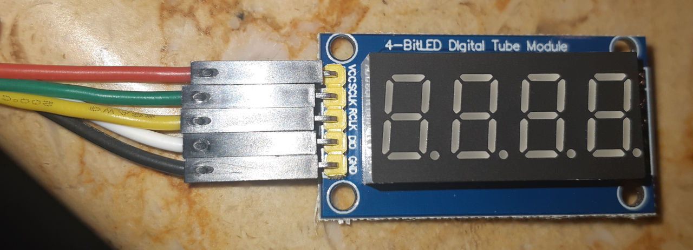
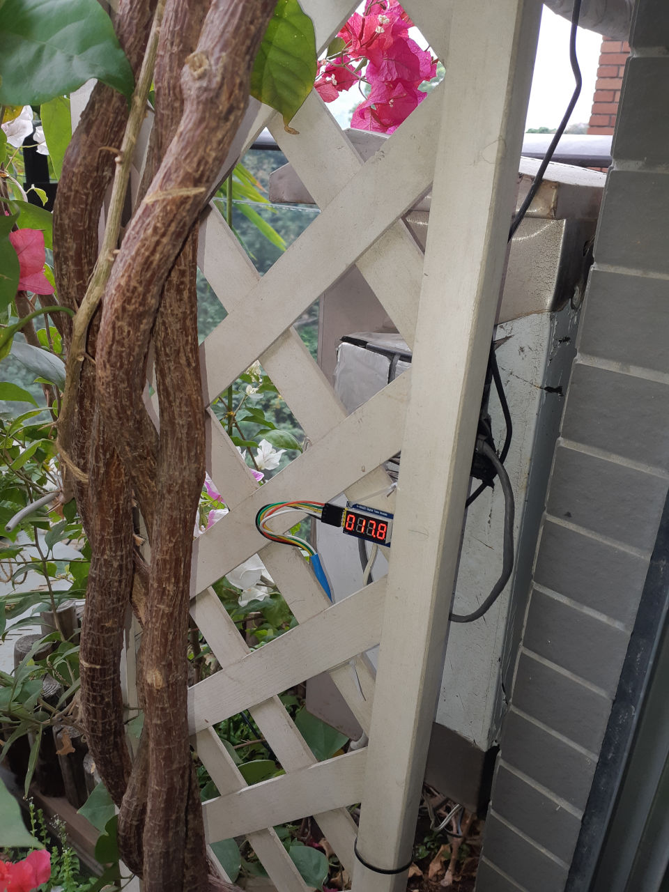
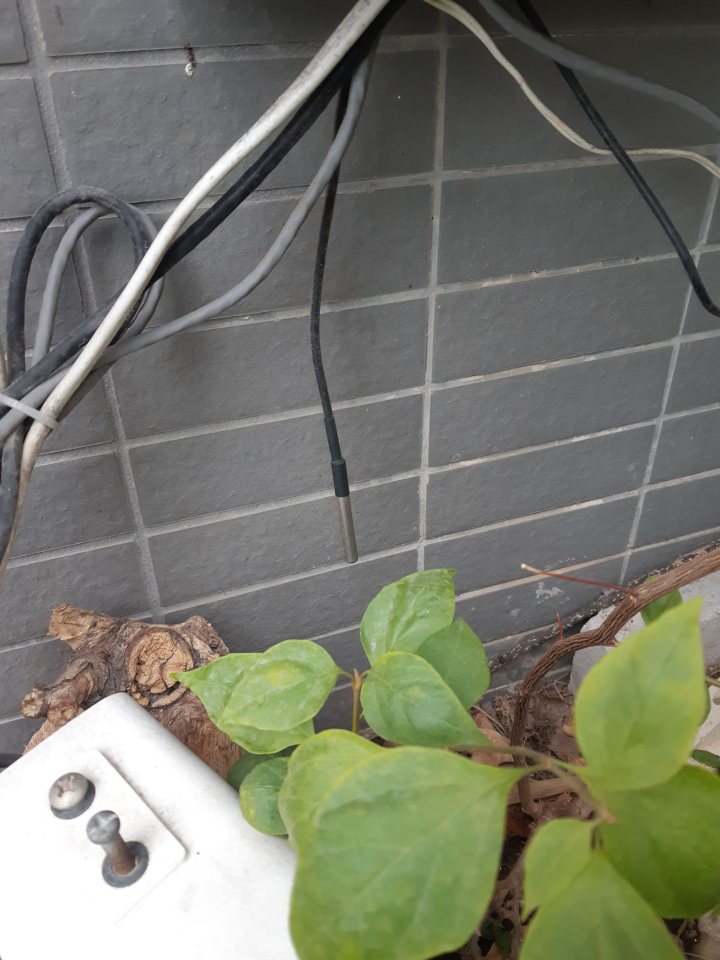

# 7-segment-temperature-display

Display current temperature on a 7-segment LED display (digital tube) from a DS18B20 sensor

## Installation

### Dependency

* New `LD_LIBRARY_PATH`: `export LD_LIBRARY_PATH=$LD_LIBRARY_PATH:/usr/local/lib/`

* pigpio
```
git clone https://github.com/joan2937/pigpio
cd ./pigpio
mkdir ./build
cd ./build
cmake ../
make
make install
```

# Images

### 7-segment Digital Tube
</img>

### Installation
</img>

### Temperature Sensor
</img>