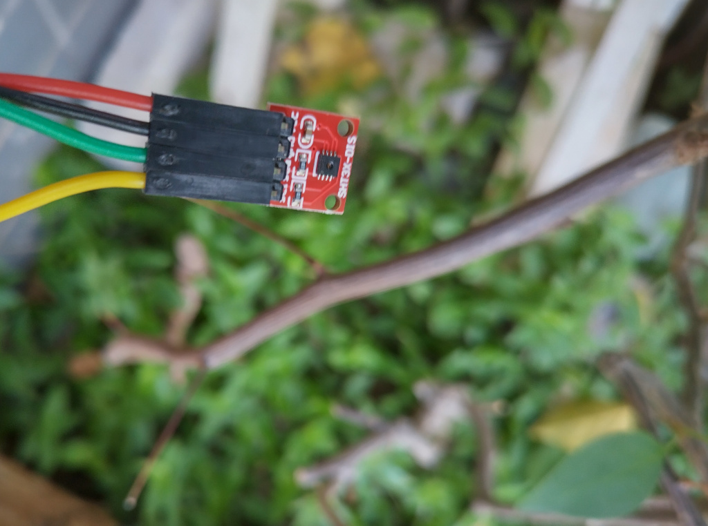

# 7-segment-SHT-display

Display real-time temperature and relative humidity on an 8-digit 7-segment LED display (digital tube) from an SHT31 sensor

## Environment and dependency

* New `LD_LIBRARY_PATH`: `export LD_LIBRARY_PATH=$LD_LIBRARY_PATH:/usr/local/lib/`.

* Enable `I2C interface` with `raspi-config`.

* Check status of `I2C` device with `dmesg | grep i2c`.

* `pigpio` to manipulate with GPIO pins.

```
git clone https://github.com/joan2937/pigpio
cd ./pigpio
mkdir ./build
cd ./build
cmake ../
make
make install
```

## Hardware

### 8-digit 7-segment Digital Tube
</img>

### Temperature and Humidty Sensor (SHT31)
</img>

### Installation
</img>