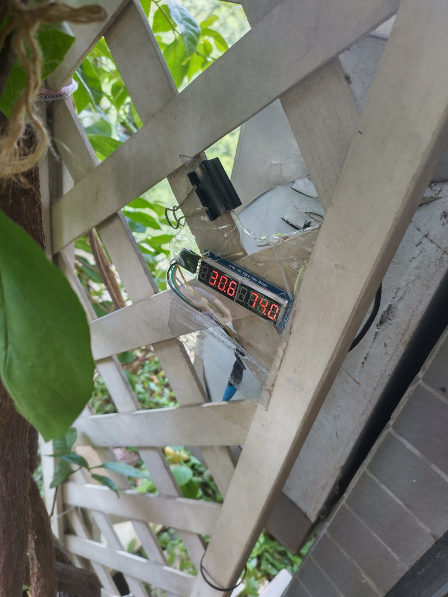

# Temperature and humidity monitor

Display real-time temperature and relative humidity on an 8-digit 7-segment LED display (digital tube) from an SHT31 sensor

## Environment and dependency

* `cURL`: `apt-get install libcurl4-gnutls-dev`
* Enable `I2C interface` with `raspi-config`.
* Check status of `I2C` device with `dmesg | grep i2c`.
* `$SEVEN_SSD_TELEMETRY_ENDPOINT` should be set to a RESTful API endpoint if data collected need to be reported to a
central server.

### Installation
</img>