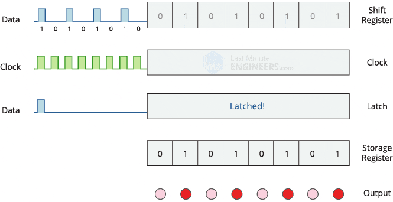

# 7-segment-SHT-display

Display real-time temperature and relative humidity on an 8-digit 7-segment LED display (digital tube) from an SHT31 sensor

## Environment and dependency

* `cURL`: `apt-get install libcurl4-gnutls-dev`

* New `LD_LIBRARY_PATH`: `export LD_LIBRARY_PATH=$LD_LIBRARY_PATH:/usr/local/lib/`.

* Enable `I2C interface` with `raspi-config`.

* Check status of `I2C` device with `dmesg | grep i2c`.

* `pigpio` to manipulate with GPIO pins.

```
git clone https://github.com/joan2937/pigpio
cd ./pigpio
mkdir ./build
cd ./build
cmake ../
make
make install
```

* `$SEVEN_SSD_TELEMETRY_ENDPOINT` should be set to a RESTful API endpoint if data collected need to be reported to a
central server.

## Hardware

### 8-digit 7-segment Digital Tube
</img>

#### How does a 74HC595 shift register work

* Have you ever found yourself wanting to control lots of LED’s? Well, you could
wire up few sensors to Raspberry Pi GPIO pins, but you would rapidly start to run out of pins.

* The solution for this is to use a 'shift register'. The 595 essentially controls eight separate
output pins, using only three input pins. 

* A digital tube has two 8-bit registers: a shift register and a storage register. The trick is:
  * We use one pin (a.k.a. Clock or SCLK) to provide regular pulse, telling the 595 how frequent
data are supplied.
  * We use another pin (a.k.a data or DI0) to write 0's and 1's to the shift register by following the frequency
of the SCLK pin.
  * We use a third pin (a.k.a latch or RCLK) to copy what is in the shift register to the storage register
  * Since the storage register has 8 bits, it can control the 7 segment LEDs of one single digit plus a dot after it.

</img>

* But we have 8 digits, how can we use one 8-bit storage register to control all of them? The answer is: we don't.
Each time we can only control what to show on one digit only. However, if we repeat the process fast enough, even if
we are only able to light up segment LEDs of one digit at a time, to human eyes, it still appears that we
can control 8 digits concurrently.
* If we make the program running slowly, naked eyes can also notice that digits are refreshed one-by-one.

</img>

* Useful reference [here](https://lastminuteengineers.com/74hc595-shift-register-arduino-tutorial/)

### Temperature and Humidty Sensor (SHT31)
</img>

### Installation
</img>